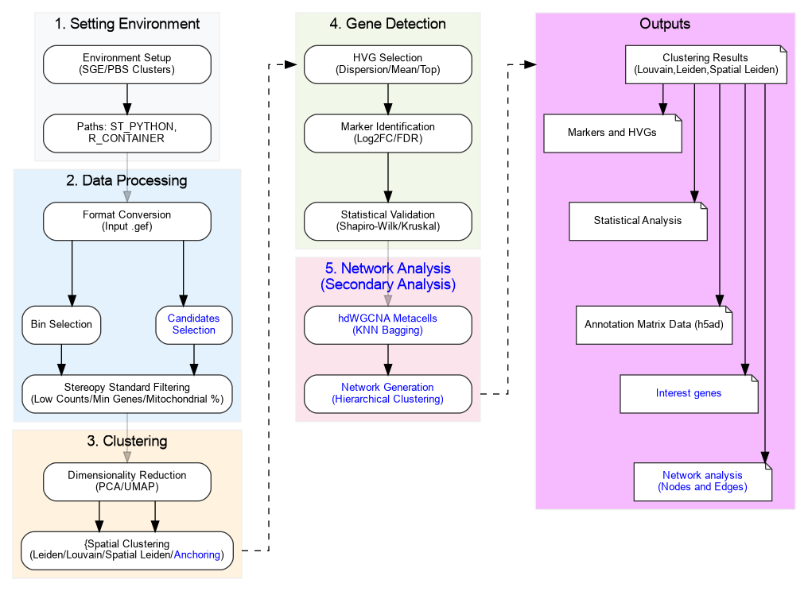

# POLY_PIPELINE

> A data analysis pipeline for STOmics data tailored to **polyploid** organisms.

---

## Overview

**POLY_PIPELINE** is a comprehensive bioinformatics pipeline designed to process and analyze **STOmics** data specifically tailored for **polyploid** organisms. It automates and simplifies several crucial steps of spatial transcriptomics data analysis, ensuring reproducibility, flexibility, and scalability for handling large, complex polyploid genomes. This pipeline leverages a modular structure and relies heavily on the [**Stereopy package**](https://github.com/STOmics/Stereopy).
The pipeline was developed to work primarily with polyploid organisms, bypassing common problems in spatial analysis; however, the script has been tested with diploids and can also be used.

## Workflow Overview

---

## Contributing

Contributions are welcome! Please fork the repository and submit a pull request.
See the [`CONTRIBUTING.md`](CONTRIBUTING.md) for details.

---

## Usage

### Initial Setup

* The pipeline is designed to be executed from the **main folder** (`POLY_PIPELINE/`).

### For [SGE clusters](https://wiki.archlinux.org/title/Son_of_Grid_Engine) the setup is automated and requires a dedicated Conda environment:
1.  **Set Environment:**
    * Run `bin/0_SET_ENV.sh` to activate the **`st`** Conda environment, which is essential due to the strict package dependencies of **Stereopy**.
2.  **Test Environment:**
    * Run `bin/1_TEST_ENV.sh` to verify the installation.

### For [PBS clusters](https://altair.com/pbs-professional) the internet connection through jobs are usually limited, follow the setup instructions manually:
1.  **Setup Container Image**
    ```bash
    cd /project/directory/POLY_PIPELINE
    module load singularity
    singularity pull stereopy_1.5.1.sif docker://mlepetit/stereopy:1.5.1.2
    ```
2.  **Verify installation inside Container**
    ```bash
    module load singularity
    singularity exec stereopy_1.5.1.sif python3 -c "import stereo as st; print(f'Stereopy version: {st.__version__}')"
    ```
3.  **Use the correct directory for job submission (check below for further instructions about variables):**
    ```bash
    qsub -v ST_PYTHON="/project/directory/POLY_PIPELINE/POLY_PIPELINE/stereopy_1.5.1.sif" bin/2_COMPLETE_ANALYSIS.sh
    ```
4.  **Setup Container for hdWGCNA (secondary analysis)**
    ```bash
    cd /project/directory/POLY_PIPELINE
    module load singularity
    singularity pull r_hdwgcna.sif docker://satijalab/seurat:latest
    ```
5.  **Install hdWGCNA (Recommended use TMUX or SCREEN)**
    ```bash
    mkdir -p /project/directory/POLY_PIPELINE/R_libs_hdwgcna
    module load singularity
    singularity exec -B /project/directory/POLY_PIPELINE r_hdwgcna.sif Rscript -e "lib_path <- '/project/directory/POLY_PIPELINE/R_libs_hdwgcna';install.packages(c('BiocManager', 'devtools', 'tester', 'enrichR', 'fastcluster', 'dynamicTreeCut', 'ggforce', 'tidygraph', 'graphlayouts', 'Hmisc', 'foreach', 'doParallel'), repos='https://cloud.r-project.org', lib=lib_path);BiocManager::install(c('WGCNA', 'GeneOverlap', 'UCell', 'enrichr', 'impute', 'preprocessCore', 'GO.db', 'GenomicRanges'), lib=lib_path, update=FALSE, ask=FALSE);devtools::install_github('smorabit/hdWGCNA', ref='dev', lib=lib_path);"
    ```
6.  **Verify installation**
    ```bash
    export R_LIBS_USER="/project/directory/POLY_PIPELINE/R_libs_hdwgcna"
    singularity exec -B /project/directory/POLY_PIPELINE r_hdwgcna.sif Rscript -e ".libPaths(c(Sys.getenv('R_LIBS_USER'), .libPaths()));library(WGCNA);library(hdWGCNA);cat('\nSuccess!\n')"
    ```
7.  **Use the correct directry for job submission (check below for further instructions about variables):**
    ```bash
    qsub -v ST_PYTHON="/project/directory/POLY_PIPELINE/stereopy_1.5.1.sif",R_CONTAINER="/project/directory/POLY_PIPELINE/r_hdwgcna.sif",ANALYSIS=3 bin/2_COMPLETE_ANALYSIS.sh
    ```
---

### Main Pipeline (Cluster Execution)

The core scripts are optimized for **SGE** and **PBS** clusters execution. They use **relative paths** and **must be run from the `POLY_PIPELINE` main directory.**

####  Data Input
The input file must be the [`.gef`](https://www.processon.com/view/link/610cc49c7d9c087bbd1ab7ab#map) file (post-processed by the [**SAW pipeline**](https://github.com/STOmics/SAW)). It **must be placed** in the `INPUT/datasets/` folder.
> **IMPORTANT:** Place **only one** `.gef` file in the `datasets` folder.

The script provides a converter (check ANALYSIS [0] below), capable of converting .GEM and .H5AD files to the proper .GEF file prior to execution

It is possible **(BUT NOT REQUIRED)** to generate differential analysis for a list of genes of interest, generate the file `INPUT/interest_genes.txt`, or use the explicit path (check below for information) following the structure:
```markdown
gene_name,Gene_ID_1,Gene_ID_2,Gene_ID_3,Gene_ID_4,Gene_ID_5
FLORAL_MERISTEM,AT5G08570,LOC107775591,Nicotiana_T001,LOC107775592
STRESS_HEAT,AT1G53540,LOC107817066,GmHIS4_A01,LOC107817067,AT2G41090
AUXIN_RESPONSE,AT3G15540,LOC107833544,Os02g0602300,AT4G20560
CELL_CYCLE,LOC107769919,AT1G44110,LOC107769920,AT3G53210
APICAL_DOMINANCE,LOC107802111,AT2G44320,LOC107802112
DEFENSE_MECH,AT5G41220,LOC107764120,Solyc01g099710
GIBBERELLIN_SYN,LOC107823450,AT1G05030,LOC107823451,AT3G44360
```
Each line represents one gene of interest starting with the identification of the gene followed by all correponding IDs (The IDs must match the mapping reference used in the generation of the .gef file).

| Step | Script | Description |
| :--- | :--- | :--- |
| [**Analysis AND Annotation**](bin/2_COMPLETE_ANALYSIS.sh) | `bin/2_COMPLETE_ANALYSIS.sh` | Complete analysis following the Stereopy documentation (generates the `stereopy_ultimate_analysis.py` script). |

#### Cluster Execution Example (SGE or PBS)

The scripts are submitted with explicit Miniconda or docker image paths and parameter variables (`qsub -v`).

* [**Analysis Script:**](bin/2_COMPLETE_ANALYSIS.sh)
    * SGE
    ```bash
    qsub -v ST_PYTHON="/home/user/.conda/envs/st/bin/python",ANALYSIS=1,MIN_COUNTS=50,MIN_GENES=5,PCT_COUNTS_MT=30,N_PCS=30 bin/2_COMPLETE_ANALYSIS.sh
    ```
    * PBS
    ```bash
    qsub -v ST_PYTHON="/project/directory/POLY_PIPELINE/stereopy_1.5.1.sif",ANALYSIS=1,MIN_COUNTS=50,MIN_GENES=5,PCT_COUNTS_MT=30,N_PCS=30 bin/2_COMPLETE_ANALYSIS.sh
    ```
    | Variable | Description | Default | 
    | :--- | :--- | :--- |
    | `ST_PYTHON` | Path to the python executable inside the st environment (SGE) or the container (PBS) for main analysis. | - |
    | `R_CONTAINER` | Path to the R container for secondary analysis (3 - Network Analysis). | - |
    | `MIN_COUNTS` | Minimum number of counts per cell. | 20 |
    | `MIN_GENES` | Minimum number of genes per cell. | 3 |
    | `PCT_COUNTS_MT` | Acceptable percentage of mitochondrial genes. | 2 |
    | `N_PCS` | Number of principal components. This step can be inproved after first run. Check the Elbow Plot (RESULTS/results_ultimate/plots/qc/pca_elbow_enhanced.png) and insert the value of the elbow as N_PCS | - |
    | `ANALYSIS` | *(Optional)* Select the type of analysis (check below for details): [0] Converter, [1] Primary analysis, [3] Network Analysis | 1 |
    | `INTEREST_GENES_PATH` | *(Optional)* Select the list of candidate genes for analysis (see above). use explicit path for custom list: INTEREST_GENES_PATH="/Storage/user/file_name.txt" | "INPUT/interest_genes.txt" |
    | `EXPRESSION_THR` | *(Optional)* Set expression threshold for Interest Genes filtering. | 1.0 |
    | `MIN_X` | *(Optional)* Minimum X coordinate for spatial filtering. | - |
    | `MAX_X` | *(Optional)* Maximum X coordinate for spatial filtering. | - |
    | `MIN_Y` | *(Optional)* Minimum Y coordinate for spatial filtering. | - |
    | `MAX_Y` | *(Optional)* Maximum Y coordinate for spatial filtering. | - |
    | `HVG_MIN_MEAN` | *(Optional)* Min mean filtering for selection of HVGs. | 0.0125 |
    | `HVG_MAX_MEAN` | *(Optional)* Max mean filtering for selection of HVGs. | 3.0 |
    | `HVG_DISP` | *(Optional)* Dispersion filtering for selection of HVGs. | 0.5 |
    | `HVG_TOP` | *(Optional)* Number of top genes selected for HVG filtering. | 2000 |
    | `INPUT_PATH` | *(Required for analysis [0] Converter)* Input file or folder with files to be converted to .gef format | - |

* Converting files (.GEM or .H5AD) to .GEF prior to primary analysis only requires the input folder or input file, bin size is optional:

* **SGE**
    ```bash
    qsub -v ST_PYTHON="/home/user/.conda/envs/st/bin/python",INPUT_PATH="path/to/file.h5ad",BIN_SIZE=100,ANALYSIS=0 bin/2_COMPLETE_ANALYSIS.sh
    qsub -v ST_PYTHON="/home/user/.conda/envs/st/bin/python",INPUT_PATH="path/to/files/",BIN_SIZE=100,ANALYSIS=0 bin/2_COMPLETE_ANALYSIS.sh
    ```

* **PBS**
    ```bash
    qsub -v ST_PYTHON="/project/directory/POLY_PIPELINE/stereopy_1.5.1.sif",ANALYSIS=0,INPUT_PATH="path/to/file.h5ad",BIN_SIZE=50 bin/2_COMPLETE_ANALYSIS.sh
    qsub -v ST_PYTHON="/project/directory/POLY_PIPELINE/stereopy_1.5.1.sif",ANALYSIS=0,INPUT_PATH="path/to/files/",BIN_SIZE=50 bin/2_COMPLETE_ANALYSIS.sh
    ```
* The variables are not required, the script can run with defaults and the entire tissue area.
* The corret python or docker image path (ST_PYTHON) for the server must be selected.
* If coordinate filtering is required (MIN_X, MAX_X, MIN_Y, MAX_Y), all coordinate parameters must be provided together.

#### Analysis selection
* The script is set to the primary analysis [1] as standard, proper for any spatial analysis from original files and generating the primary results.
* The script includes secondary analysis for specific uses: [3] for network analysis.
* Options must be explicit when submiting the job (or [1] will be used as standard).

#### Local Execution Example
> **IMPORTANT:** This analysis requires high computational resources and are not recommended to be run locally.
To run the main analysis locally using the `bash` wrapper and your specific Conda path:

```bash
ST_PYTHON='/home/user/.conda/envs/st/bin/python' MIN_COUNTS=50 MIN_GENES=5 PCT_COUNTS_MT=30 N_PCS=30,ANALYSIS=1 bash bin/2_COMPLETE_ANALYSIS.sh
```

---

### Miscellaneous Pipeline (Secondary analysis)

| Step | Script | Description | Usage | Observations | Standalone | Main Analysis |
| :--- | :--- | :--- | :--- | :--- | :--- | :--- |
| [**File Converter**](bin/SCRIPT_CONVERTER.py) | `bin/SCRIPT_CONVERTER.py` | Script for converting .H5AD and .GEM files to the proper .GEF file prior to main analysis | python bin/SCRIPT_CONVERTER.py | The script generates the converted file and summary informations | Optional | 0 |
| [**Network Analysis**](bin/SCRIPT_NETWORK_ANALYSIS.r) | `bin/SCRIPT_NETWORK_ANALYSIS.r` | Script for generating WGCNA network based on the Highly Variable Genes (HVG) generated from the primary analysis. | Rscript bin/SCRIPT_NETWORK_ANALYSIS.r 2>&1 | The script generates all individual clusters and the complete file for posterior visualization (Cytoscape/others), check guide below | Optional | 3 |

* Standalone scripts should be run locally since they are not included in the main pipeline, all other (Optional) can be run from the main scripts as secondary analysis (check Analysis options section).
* If coordinate filtering is required (min_y, max_y, min_x, max_x), all coordinate parameters must be provided together.
---

### Network Visualization (Secondary analysis)
* Example of job command (SGE):
```bash
qsub -v ST_PYTHON="home/user/.conda/envs/st/bin/python",ANALYSIS=3 bin/2_COMPLETE_ANALYSIS.sh
```
* Example of job command (PBS):
```bash
qsub -v ST_PYTHON="/project/directory/POLY_PIPELINE/stereopy_1.5.1.sif",R_CONTAINER="/project/directory/POLY_PIPELINE/r_hdwgcna.sif",ANALYSIS=3 bin/2_COMPLETE_ANALYSIS.sh
```
* After running the secondary network analysis, the Edges and Nodes files will be generated under the EXPORTS folder, which can be used for posterior visualizations/filtering, mainly [**NETWORKX**](https://networkx.org/en/) and [**Cytoscape**](https://cytoscape.org/).


* Importing for Cytoscape:
* `File` -> `Import` -> `Network from File...`.
* Select file EXPORTS/[project_name]_FULL_EDGES.txt.
* Under the configuration, select `fromNode` (Source Node), `toNode` (Target Node) and `weight` (Edge Attribute).
* Click `OK`.
* `File` -> `Import` -> `Table from File...`.
* Select file EXPORTS/[project_name]_FULL_NODES.txt.
* Select (auto) column `gene_name` as key.
* Click `OK`.
* For proper coloring clusters: Select **Style** from sidebar, select `Fill Color`, select `module` as column, select **Discrete Mapping** and use right buttom to select `Mapping Value Generators` to automatically select colors for each module.
* Check documentation for further details.
---

## Project Structure
```markdown

POLY_PIPELINE/
├── CONTRIBUTING.md
├── INPUT/
│   └── datasets/
│       ├── <place .gef file here>
│       └── <(OPTIONAL) place interest_genes.txt here>
├── LICENSE
├── RESULTS/
│   └── <results folders and compressed files generated>
├── README.md
└── bin/
    ├── 0_SET_ENV.sh
    ├── 1_TEST_ENV.sh
    ├── 2_COMPLETE_ANALYSIS.py
    ├── SCRIPT_CONVERTER.py
    ├── SCRIPT_NETWORK_ANALYSIS.r
    ├── SCRIPT_PRIMARY_ANALYSIS.py
    └── SCRIPT_SECONDARY_ANALYSIS.py
```

---

## License

This project is licensed under the [MIT License](LICENSE).

---
